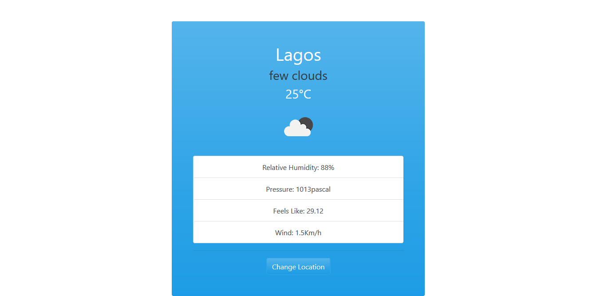

# Weather-App
 A weather forecast site using the weather API (https://openweathermap.org/current) built with JavaScript.

 ### Prerequisites

- Node
- Npm

### Setup

- git clone `https://github.com/evansinho/Weather-App`
- cd Weather-App
- run npm install
- run npm run build
- Open the dist/index.html file in any web browser of your choosing.

## Live 

[live demo](https://raw.githack.com/evansinho/Weather-App/weather/dist/index.html)

## snaphot

### Usage

- Visit the live demo link on your web browser.

## Authors

👤 **Evanson Igiri**

- [Portfolio](https://evansinho.github.io/Evanson-igiri/)
- [Twitter](https://twitter.com/iamsinho1304)
- [Linkedin](LinkedIn.com/in/evanson-igiri)
- [Email](mailto:igiri.evanson@gmail.com)

## 🤝 Contributing

Contributions, issues and feature requests are welcome!

Feel free to check the [issues page](https://github.com/evansinho/Weather-App/issues).

## Show your support

Give a ⭐️ if you like this project!
